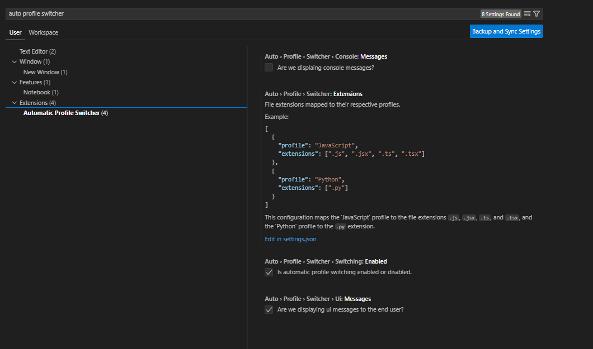

# Automatic Profile Switcher Extension

The Automatic Profile Switcher extension, aims to automatically switch profiles based on your defined extensions. I was tired of my multi technology repos having the wrong set of extensions and I found my self wasting about 1-2 secs everytime I changed items.

## Settings

### `autoProfileSwitcher.switching.enabled`

* __Description:__ Enables or disables the automatic profile switching feature.
* __Type:__ Boolean
* __Default:__ true
* __Usage:__ When set to `true`, the extension automatically switches profiles based on the file extension or project type. Set to `false` to disable this functionality.


### `autoProfileSwitcher.extensions`

* __Description:__ Controls whether informational messages are displayed when profiles are switched.
* __Type:__ Boolean
* __Default:__ true
* __Usage:__ Set to `true` to display messages when a profile switch occurs. If set to `false`, no messages will be shown. 

### `autoProfileSwitcher.extensions`

* __Description:__ Defines the mapping between file extensions and their respective profiles. This allows customization of which profile is activated when certain file types are opened.
* __Type:__ Array of objects
* __Default:__ []
* __Structure:__ Each object in the array represents a profile and its associated file extensions. The object has the following properties:
  * `profile`: (String) The name of the profile.
  * `extensions`: (Array of Strings) List of file extensions associated with the profile.
* __Usage:__ Add objects to the array to map specific profiles to their corresponding file extensions. For example, you can add an object to map the `"JavaScriptProfile"` to `[".js", ".jsx"]` extensions.

Example Settings ( `settings.json` ):

```json
{
  "autoProfileSwitcher.switching.enabled": true,
  "autoProfileSwitcher.display.messages": true,
  "autoProfileSwitcher.extensions": [
    {
      "profile": "JavaScriptProfile",
      "extensions": [".js", ".jsx"]
    },
    {
      "profile": "PythonProfile",
      "extensions": [".py"]
    },
    {
      "profile": "JavaProfile",
      "extensions": [".java"]
    }
  ]
}
```

Settings ( `Setting UI` )

 

## Commands

### `autoProfileSwitcher.switching.enable`
* __Description:__ Command to enable the automatic profile switching feature.
* __Usage:__ Run this command to turn on automatic profile switching if it is currently disabled.

### `autoProfileSwitcher.switching.disable`
* __Description:__ Command to disable the automatic profile switching feature.
* __Usage:__ Run this command to turn off automatic profile switching if it is currently enabled.

### `autoProfileSwitcher.display.messages.enable`
* __Description:__ Command to enable the display of informational messages during profile switches.
* __Usage:__ Use this command to show messages whenever a profile switch occurs.

### `autoProfileSwitcher.display.messages.disable`

* __Description:__ Command to disable the display of informational messages during profile switches.
* __Usage:__ Use this command to suppress messages during profile switches.


### Example Commands Interface
Below is a screenshot showing how to access these commands in VS Code. To access the commands, press `Ctrl+Shift+P` (Windows/Linux) or `Cmd+Shift+P` (macOS) to open the Command Palette and type the command name `Automatic Profile Switcher`.


## TODO

For more information on tasks and future improvements, please see the [TODO file](TODO).